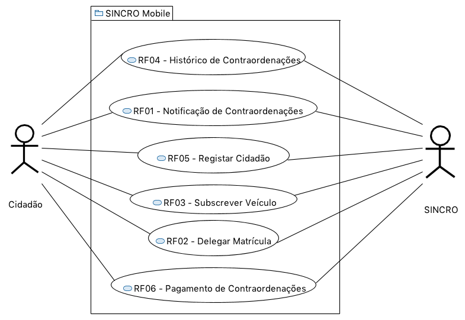
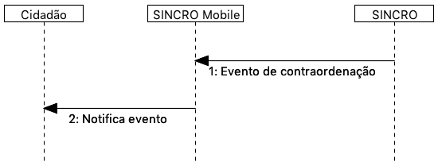
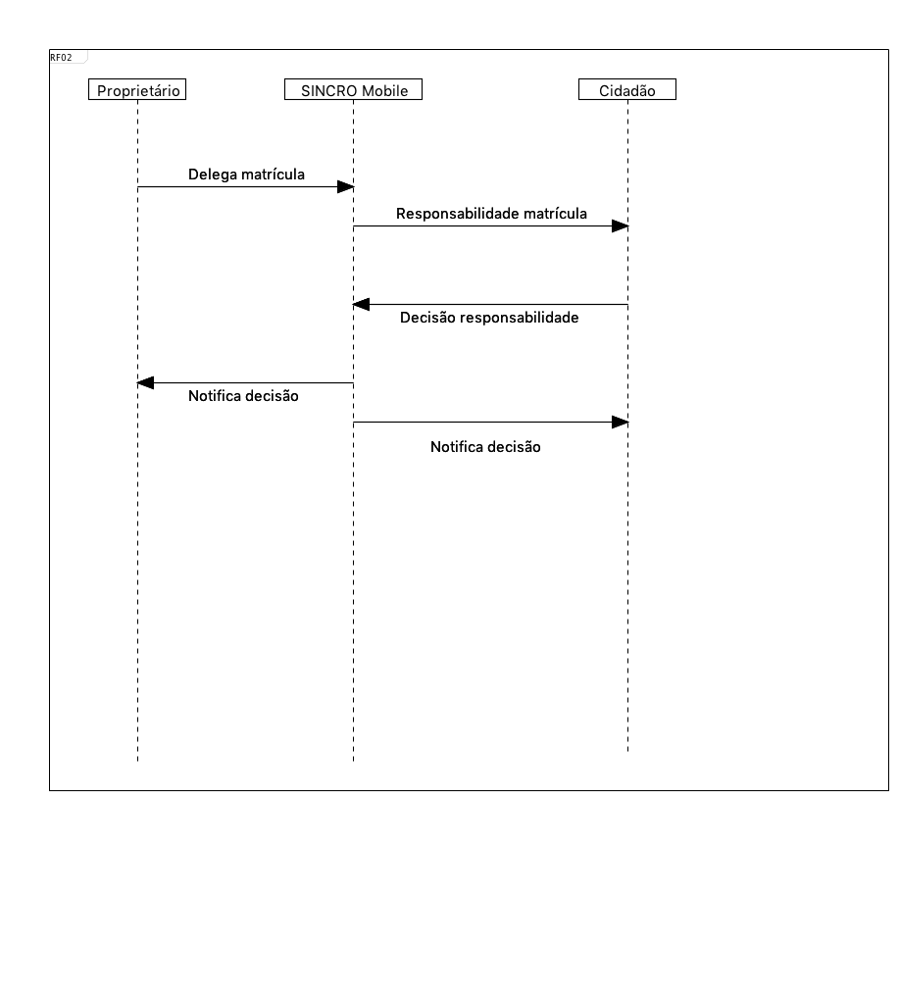
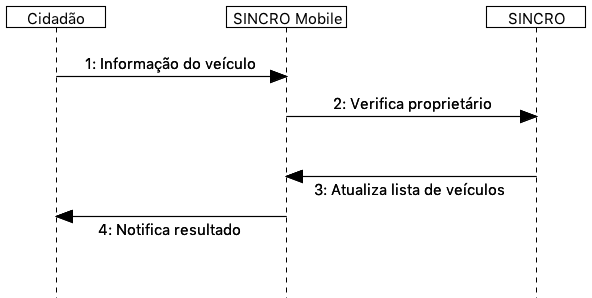
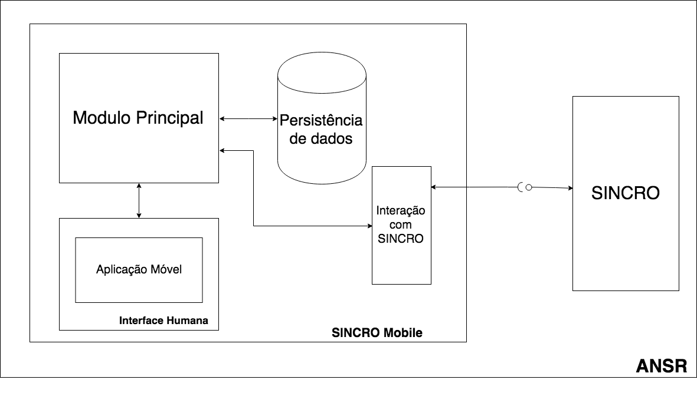

:general_picture: Figura 1
:use_case: Figura 2
:rf01: Figura 3
:rf02: Figura 4
:rf03: Figura 5
:rf04: Figura 6
:rf05: Figura 7
:rf06: Figura 8
:arquiteture: Figura 9

= Gestão de Eventos de Contraordenação Por Excesso de Velocidade

---

image::./adoc_images/isel_logo.png[]

**Realizado por:** +
André Gaudêncio, nº 42204 +
Nuno Conceição, nº 42195

**Orientadores:** +
Engenheiro Luís Osório, lo@isel.ipl.pt +
Paulo Borges, pborges@deetc.isel.ipl.pt

---

Relatório de progresso realizado no âmbito de Projecto e Seminário, do curso de licenciatura em Engenharia Informática e de Computadores Semestre de Verão 2017/2018

Abril de 2018 

<<<

==== Resumo
O foco deste projeto é o desenvolvimento de um protótipo de um serviço que permite ao cidadão o acesso imediato a um evento de excesso de velocidade. Os eventos são gerados através dos cinemózetros pertencentes à SINCRO footnoteref:[sincro,Rede Nacional de Controlo de Velocidade]. +
Uma vez infringida a velocidade extipulada no local onde se encontra um cinemómetro, os dados do evento irão ser armazenados, para posteriormente serem enviados e avaliados pelo sistema informático da ANSR footnoteref:[ansr,Autoridade Nacional de Segurança Rodoviária]. Uma vez decorrido este processo e validados os eventos de trânsito, caso exista excesso de velocidade, o dono do veículo deverá ser notificado via dispositivo móvel sobre os detalhes do evento.

.Imagem Geral

Atualmente o sistema de notificação de contraordenações por excesso de velocidade é feito manualmente através de correio. Com este projeto deverá ser possível ao cidadão subscrever os seus veículos através do seu dispositivo móvel, possibilitando ser notificado de quaisquer eventos que ocorram nos veículos registados. Este projeto é motivado sobre a informação do evento de controlo de passagem de excesso de velocidade, na expetativa que haja a redução de situações de violação do excesso de velocidade. Através de uma plataforma móvel acreditamos que seja possível que o condutor fique mais atento à sua condução, dado que os alertas recebidos são visualizados num espaço de tempo reduzido. 

<<<

==== Análise 
Para este projeto será necessário a criação de um Servidor. Este vai ser responsável por emitir notificações de eventos para os dispositivos móveis, bem como processar pedidos sobre informações relativas ao utilizador do dispositivo. +
O Servidor terá a responsabilidade de trabalhar dados provenientes do Sistema Informático SINCRO footnoteref:[sincro]. Só assim é possível ter acesso aos eventos gerados pelos cinemómetro e já corretamente avaliados e autorizados a serem notificados. +
Também será necessária a realização da Componente Móvel (telemóvel, ou outro dispositivo equivalente) através do qual o utilizador realizará os pedidos ao servidor e receberá as notificações sobre eventos de trânsito.

==== Ferramentas
A figura 1 apresenta uma vista geral sobre o projeto. +
O servidor irá ser criado numa linguagem que dê suporte para aplicações servidoras (Java, Node.js, .NET, etc.). Relativamente aos dispositivos móveis iremos usar uma linguagem que dê suporte a multiplataforma (React Native, Xamarin, Native Script).

==== Problemas
A bateria limitada nos dispositivos móveis é algo a ter em conta na realização deste projeto. Uma aplicação que utilize em grandes quantidades a energia de um dispositivo pode ser facilmente posta em causa e possivelmente desinstalada. +
A quantidade e variedade de dispositivos móveis existentes no mercado é também um dos problemas a considerar no projeto. Deverá ser desenvolvida uma aplicação passível de ser utilizada por qualquer condutor proprietário de um automóvel.

[cols="5,14",options="header"]
|=========================================================
|Problemas |Possíveis Soluções

|Poupança Bateria
|Utilização de notificações ‘Push’
|Variedade de Dispositivos Móveis
|Utilizar uma linguagem que possibilite a redução de código nativo, linguagem multiplataforma
|=========================================================
<<<

==== Requisitos Funcionais
No sistema SINCRO Mobile footnoteref:[sincro_mobile,Sistema de Gestão de Eventos de Contrarodenação Por Excesso de Velocidade] serão implementados os seguintes requisitos funcionais, presentes na {use_case}. Cada requisito funcional foi idêntificado com o indentificador RF footnote:[Requisito Funcional] seguido pelo respetivo número.

.Diagrama Caso de Uso

Para efetuar os mesmos será necessário a comunicação com a entidade SINCRO footnoteref:[sincro]. Quanto ao cidadão, este terá acesso a todas as funcionalidades. +

<<<

===== RF01 - Notificação de Contraordenações
O proprietário do veículo recebe a notificação acerca do evento no seu telemóvel. As informações sobre o evento são enviadas pelo sistema SINCRO footnoteref:[sincro].

.Requisito Funcional I

. O evento de contraordenação é enviado do sistema SINCRO footnoteref:[sincro] para o SINCRO Mobile footnoteref:[sincro_mobile], onde irá ser guardado. +
. Posteriormente irá ser enviada uma notificação ao Cidadão com as informações sobre o respetivo evento.

<<<

===== RF02 - Delegar Matrícula
Permite o utilizador delegar o seu veículo a outro utilizador, já registado no sistema, que aceite esta responsabilidade.

.Requisito Funcional II

. Envio do pedido de delegação por parte do Proprietário. Onde irá constar a respetiva matrícula e o Cidadão a quem delega a responsabilidade.
. O Cidadão irá receber um pedido para aceitar a responsabilidade do veículo.
. O Cidadão envia decisão face a responsabiliade.
. Se o Cidadão aceitar a responsabilidade (3), deverá ser entregue ao proprietário uma notificação de sucesso. Caso contrário irá receber uma notificação de insucesso.
. Se o Cidadão aceitar a responsabilidade (3), o mesmo irá receber uma notificação sobre o veículo e respetiva matrícula pelo qual é responsável. Caso contrário a notificação não terá efeito.

<<<

===== RF03 - Subscrever Veículo
Depois de registado, o utilizador poderá subscrever as suas viaturas, bem como viaturas delegadas por outros utilizadores. Passando a ser o responsável por quaisquer futuros eventos.

.Requisito Funcional III

. Envio da matrícula e dados que possam identificar o veículo a subscrever.
. Informação é enviada para o sistema SINCRO footnoteref:[sincro] onde irá ser verificada a autenticidade do proprietário.
. Lista de veículos do Cidadão é atualizada com base no resultado do passo anterior (2).
. Cidadão é notificado com o resultado da operação.

<<<

===== RF04 - Histórico de Contraordenações
É disponibilizada uma lista de contraordenações com os últimos eventos ocorridos. O utilizador poderá visualizar os eventos de contraordenação e aceder à sua informação.

.Requisito Funcional IV
image::./adoc_images/sequence/rf04.png[]

. Pedido de histórico do Cidadão
. Envio do pedido (1) para o sistema SINCRO footnoteref:[sincro]
. É devolvido ao SINCRO Mobile footnoteref:[sincro_mobile] o histórico do Cidadão
. Cidadão recebe histórico de contraordenações.

<<<

===== RF05 - Registar Cidadão
Para ter acesso a quaisquer funcionalidades é necessário o cidadão se registar no sistema através do seu cartão de cidadão e do seu contacto telefónico de forma a ser identificável pelo sistema.

.Requisito Funcional V
image::./adoc_images/sequence/rf05.png[]

. Envio dos dados do Cidadão (nome,cartão de cidadão, morada, número, etc).
. Verificação da validade da identidade do Cidadão.
. Se a identidade for verificada com sucesso pelo sistema SINCRO footnoteref:[sincro] é adicionado um novo utilizador. Em caso de insucesso não ocorre alteração nenhuma.
. Cidadão recebe confirmação do seu registo. Caso o passo (3) tenha resultado em insucesso, o seu registo é rejeitado.

<<<

===== RF06 - Pagamento de Contraordenações
Será disponibilizado para qualquer contraordenação a possibilidade de pagamento do valor respetivo da mesma. 

.Requisito Funcional VI
image::./adoc_images/sequence/rf06.png[]

. Envio do pedido de pagamento.
. São disponibilizadas as formas de pagamento que o Cidadão poderá escolher.
. É confirmado o método de pagamento
. Envio do formulário de pagamento. No qual o utilizador poderá verificar os valores de pagamento e a respetiva contrardenação que pretende saldar.
. Confirmação de pagamento é enviada.
. Transação monetária é feita através do sistema SINCRO footnoteref:[sincro].
. Confirmação é enviada em caso de sucesso da transação (6).
. Cidadão é notificado com o resultado do pagamento da contraordenação.

<<<

==== Requisitos Não Funcionais

Todas as garantias necessárias de realizar de forma possibilitar a implementação dos requisitos não funcionais são do nosso interesse. Contudo não nos comprometemos com a realização das mesmas. 

---

===== RNF01 - Escalabilidade
O sistema irá ser desenhado de forma a suportar múltiplos acessos por vários utilizadores. Deverão ser utilizadas técnicas como o balanceamento de carga e distribuição de operações de forma a resultar num melhor desempenho dp sistema.

===== RNF02 - Segurança
Dada a importância deste tipo de informação apresentado na aplicação, deverão ser usadas formas de possibilitar a máxima segurança no sistema.

===== RNF03 - Tolerância a falhas
O cidadão irá usar o nosso sistema para efetuar pagamentos e aceder a informação importante. Deverá ser garantido o bom funcionamento da nossa aplicação e irá ser dado suporte para possíveis falhas.

===== RNF04 - Rapidez de Entrega
Uma vez que o sistema funcionará todo através de sistemas informáticos, vai ser possível uma entrega ao utilizador mais rápida, dos eventos de contraordenação.

<<<

==== Arquitetura do projeto
Com base no objetivo do sistema SINCRO Mobile footnoteref:[sincro_mobile] foi necessário desenhar uma arquitura precisa do projeto.

.Arquitetura do Projeto

Na {arquiteture} é possível visualizar os componentes presentes na arquitura e as interligações das mesmas.

<<<

===== Módulo Principal
O Módulo Principal irá ser responsável por implementar todas as funcionalidades disponíveis no SINCRO Mobile footnoteref:[sincro_mobile].
Todos os componentes envolvidos no sistema irão desempenhar funções com base nas decisões do Módulo Principal.

===== Persistência de Dados
A componente de Persistência de Dados tem a responsabilidade de garantir a segurança dos dados, bem como o controlo do acesso aos mesmos. +
Como está presente na imagem, o Módulo principal irá efetuar o acesso a dados e a alteração dos mesmos. Quanto ao componente de Interação com o sistema SINCRO footnoteref:[sincro], este irá apenas realizar alteração dos dados.

===== Interface Humana
Esta componente, Interface Humana, é constituída por duas componentes internas. Uma componente aplicacional realizada para dispositívos móveis e outra componente para web. +
A Aplicação Móvel irá funcionar como interface para o cidadão utilizador das funcionalidades presentes no sistema SINCRO Mobile footnoteref:[sincro_mobile]. +
A componente Aplicação Web vai ser de realização opcional. Será construída com o propósito de disponibilizar informação interna passível de ser utilizada para consulta de _mensagens de log_.

<<<

===== Interação com SINCRO 
Tem como função principal interagir com o sistema SINCRO footnoteref:[sincro] para a realização de funcionalidades presentes no nosso sistema que exijam funcionalidades presentes na interface SINCRO.

===== Interface de Comunicação com SINCRO
O sistema SINCRO footnoteref:[sincro] contém informações das quais não poderemos ter acesso. Será necessário criar esta interface para que seja possível simular a comunição com o mesmo. + 
A mesma irá ser bastante útil na realização de testes e bom funcionamento do sistema SINCRO Mobile footnoteref:[sincro_mobile].

